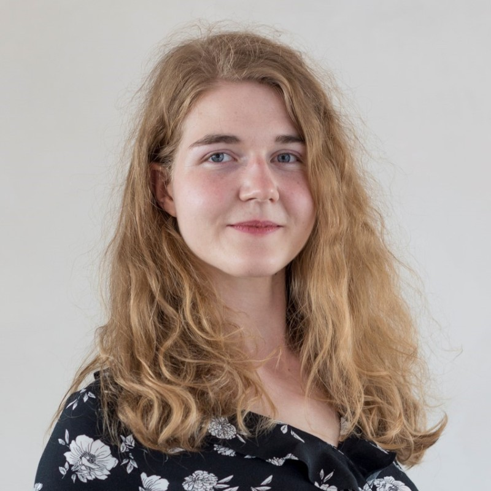

# Team

Iris Grže - Project leader
 

Anastasia Pustozerova - Smart System Developer
 

Jože Bajuk - Content and App Developer
 

Rok Kos - Main App Developer
 

 

## Experience
Together we have more than 70 years of experience with math! We always enjoyed helping others with it and now we want to help even more people to understand, use and grow fond of mathematics.

Among other things, Joze and Rok each have 5 years of tutoring experience and Iris and Anastasia have Bachelor's degrees in mathematics.

 

## Believe
We have passion for math and a great group synergy which is the key for making MathPie an impactful project.
 

